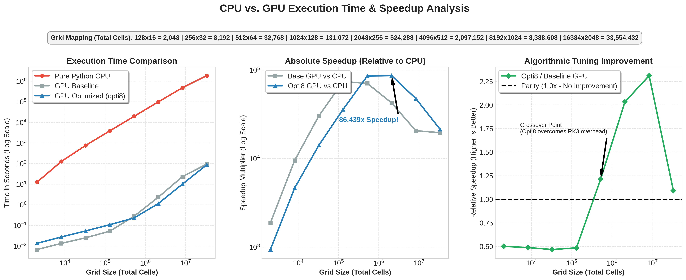
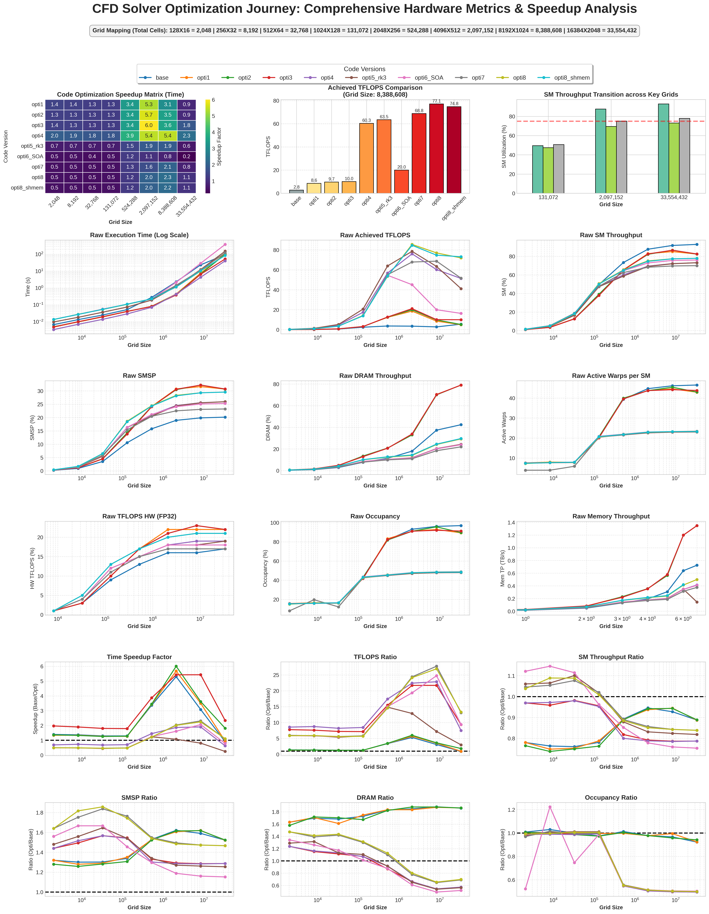
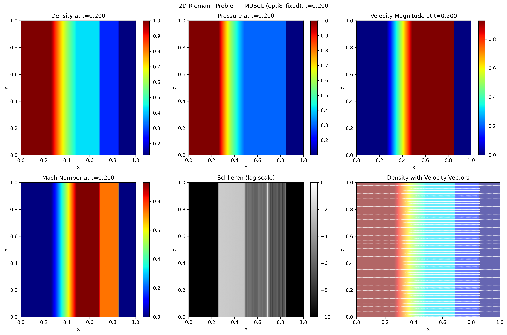
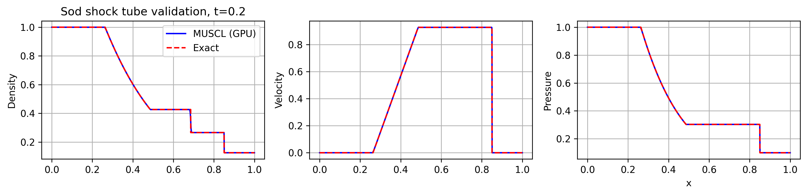

# GPU-Accelerated 2D Euler CFD Solver
*(Note: This repository contains an optimized flow solver achieving an 86,439x speedup over standard CPU baselines).*

### 🎯 Objective
To develop a highly parallelized 2D compressible flow solver to minimize simulation turnaround for the Sod Shock Tube (Riemann) problem.

### ⚙️ Physics & Numerical Methods
* **Governing Equations:** 2D Euler equations for compressible flow.
* **Spatial Reconstruction:** High-Order MUSCL finite-volume scheme.
* **Time Integration:** 3rd-Order SSP-Runge-Kutta (RK3).
* **Implementation:** Written in Python and dynamically compiled to CUDA using the NVIDIA Warp framework.

### 🚀 Extreme GPU Optimization (RTX PRO 6000)
* **Memory Layout Refactoring:** Transitioned from Array of Structures (AoS) to a Structure of Arrays (SoA) paradigm with a highly tuned execution block dimension of 256.
* **Extreme Kernel Fusion:** Fused flux computations and RK3 updates into fewer kernels. Intermediate quantities are largely kept in registers, minimizing global memory traffic.
* **Hardware Limits:** Active occupancy stabilizes at ~48%, matching the hardware limit (~50%) due to high register usage (~80 registers/thread).

### 📊 Performance & Scaling Results

* **Absolute CPU Speedup:** Achieved an **86,439x speedup** over unoptimized Python CPU execution.
* **Algorithmic Scaling:** Despite a 3x mathematical workload increase transitioning to RK3, deep memory optimization yielded a massive **2.31x raw speedup** over the naive GPU baseline.
* **Massive Grid Simulation:** Successfully simulated a 33.5M-cell grid (16384x2048) in ~85.3 seconds.
* **Sustained Compute Efficiency:** Reached ~77-78% SM throughput and sustained ~72-77 TFLOPS (~20-21% of theoretical FP32 peak) in a compute-dominant regime.

### 🌪️ Flow Visualization

